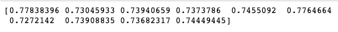
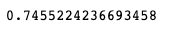
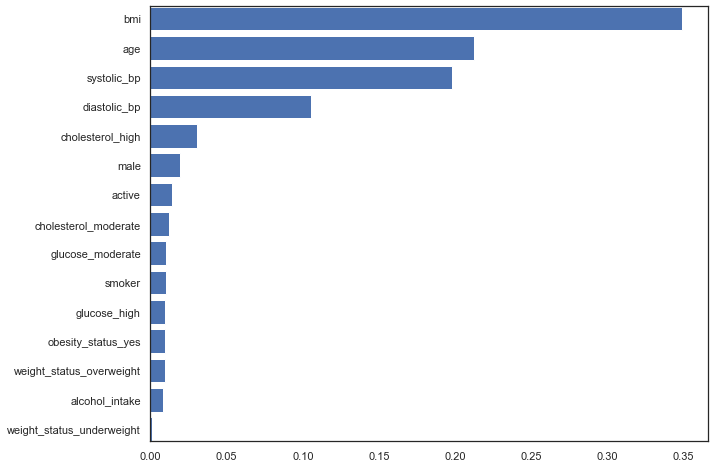
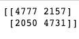
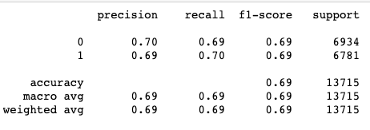
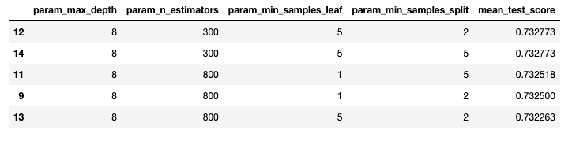
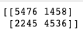
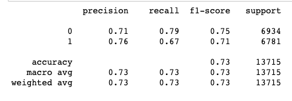
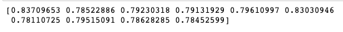
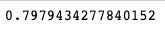

# Be Heart Smart

### Purpose
The purpose of this project is to predict the risk of cardiovascular disease based on existing health and lifestyle factors.

### Resources used
- Data : https://www.kaggle.com/sulianova/cardiovascular-disease-dataset version 1 (Created 2019-01-19)

- Software : Microsoft Excel 2018, Google Colab, Spark 3.1.2

## Observations on dataset
The data had values separated by semicolons. It was converted into a csv using Microsoft Excel. Initial observations were made in Microdoft excel\
The following are the ranges of each continuous feature of the dataset, and the values for each categorical features of the original dataset
- Age range:  29 to 65 years.
- Gender : Categorical binary(1-female, 2-male)
- Height: 55 - 250 (cm)
- Weight: 10 to 200 (kg)
- ai-hi systolic: -150 to 16020
- ap_lo diastolic: -70 to 11000
- Cholesterol: Categorical (1:normal, 2:above normal, 3:well above normal)
- Glucose: Categorical (1:normal, 2:above normal, 3:well above normal)
- Smoker : Categorical binary (1-yes, 0-no)
- Alcohol intake : Categorical binary (1-yes, 0-no)
- Physical activity : Categorical binary (1-yes, 0-no)
- Cardio Y/N : Categorical binary (1-yes, 0-no)(Target)

Notice that some continuous variables have values that out of range or are improbable.\
This may have occured due to different reasons like human error when entering the values in dataset, ommitting changing units between kilograms and pounds, possibility of values being read from a machine into the dataset, misplacement of decimal points etc.

## Plan for data processing
As number of observations are 70K, PySpark will be used for initial data processing, and EDA.\
Desicions have to be made on how to treat each datapoint that is out of range of expected values, depending on whether it is worth retaining in the dataset and why, or can it be removed from the final working dataset.\
The first step towards data clean up will be putting the continuous variables within its probable ranges (including extreme values that it may take). Numbers that are improbable for adult humans, for eg. a systolic value of 16020, will be removed. It is possible that the original value may have been 160.20, however as there is no way to confirm that, and because the total numbers of datapoints were so high, the decision was taken to remove rows with such high values.

Continuous variables will retain the following values.
- Height: 135 cm to 215 cm  
- Weight: 25 kg to 200 kg 
- Systolic bp: 80 to 180. The negative numbers (-150, -140, -120, -115, -100) were also kept. Their sign would be changed.
- Diastolic bp: 40 to 120, and -70 (Negative sign will be changed)

The above numbers limit were decided taking into account possible extreme measured values for the features.\
Height was given a range of 4 feet 5 inches to 7 feet.\
The lowest range of weight was taken for an underweight female of height 4 feet 5 inches.\
The range of systolic and diastolic bp was decided on possible values of hypotension and hypertensive crisis values.\

The categorical variables will first be defined according to healthcare standards.
- Cholesterol: normal (< 200), Moderate (200-240), High (> 240)
- Glucose: normal (< 140), Moderate (140-200), High (> 200) units:mg/dL

Age here is given in days, and it will be converted to years.

Categorical variables will be expanded with one hot encoding.\
This is to prevent any value of a categorical variable being more than another. For eg. in gender male (2) should not have a greater value than female(1).

# Be Heart Smart ❤

## Resources used
Data : https://www.kaggle.com/sulianova/cardiovascular-disease-dataset version 1 (Created 2019-01-19)

Software : Microsoft Excel 2018, Google Colab, Spark 3.1.2, Jupyter Notebook.

## Insight into the raw data

* The data had values separated by semicolons. 
* It was converted into a csv using Microsoft Excel. 
* Initial observations were made in Microsoft excel.
* Some continuous variables have values that out of range or are improbable.
* This may have occurred due to different reasons like human error when entering the values in dataset, omitting changing units between kilograms and pounds, possibility of values being read from a machine into the dataset, misplacement of decimal points etc.

## Data Processing and Initial Exploratory Data Analysis on Raw Data using PySpark

* Since the number of observations are 70K, PySpark was used for initial data processing, and exploratory data analysis on the raw data.  
* Decisions were taken on treating datapoints that are out of range of the expected values, for example whether it is worth retaining in the dataset or should be removed from the final working dataset.
* The first step towards data cleaning was putting the continuous variables within its probable ranges. Numbers that are improbable for adult humans, for eg. a systolic value of 16020, was removed. It is possible that the original value may have been 160.20, however as there is no way to confirm that, and because the total numbers of data points were so high, the decision was taken to remove rows with such high values.
* Continuous variables with the following values were retained:
    - Height: 135 cm to 215 cm  
    - Weight: 25 kg to 200 kg 
    - Systolic bp: 60 to 240. 
    - The negative numbers (-150, -140, -120, -115, -100) were also kept. Their sign was changed.
    - Diastolic bp: 30 to 120, and -70 (Negative sign was be changed)
* The above numbers limit were decided taking into account possible extreme measured values for the features observed in the human population. 
* Height was given a range of 4 feet 5 inches to 7 feet.
* The lowest range of weight was taken for an underweight female of height 4 feet 5 inches.
* The range of systolic and diastolic bp was decided on possible values of hypotension and hypertensive crisis values. Initial analysis of data on excel showed that high systolic bp values corresponded to cardio disease being present, and these datapoints are is required for the present analysis. These considerations led into deciding the cut-off number for systolic bp.
* The categorical variables were defined according to healthcare standards.
    - Cholesterol: normal (< 200), Moderate (200-240), High (> 240)
    - Glucose: normal (< 140), Moderate (140-200), High (> 200) units:mg/dL
* Age in the original dataset is given in days, and it was converted to years.
* No null values were observed in any of the columns.
* No duplicate observations were found.
* The cleaned data was saved as 
* The frequency of occurance of different categorical variables were found to be the following:
	- Gender : Males 45530, Females 24470
	- Cholesterol : normal 52385, moderate 9549, high 8066
	- Glucose :  normal 59479, moderate 5190, high 5331
	- Smokers : no 63831, yes 6169
	- Alcohol_intake : no 66236, yes 3764
	- Active : no 13739, yes 56261
	- Cardio_disease :  no 35021, yes 34979
* After cleaning, the number of observations were reduced to 68,571.
* The cleaned data was stored as final_cardio_cleaned.csv
* The cleaned csv file was loaded into PostgreSQL database Be_Heart_Smart and stored into a table called final_cardio_cleaned (with columns :tbl_id, age, gender, height, weight, systolic_bp, diastolic_bp, cholesterol, glucose, smoker, alcohol_intake, active, and cardio_disease)

* Categorical variables were expanded with one hot encoding.
This is to prevent any value of a categorical variable being more than another. For eg. in gender male (2) should not have a greater value than female(1).

## Machine Learning

### Communication Channels:

* Slack: Instant messaging with team members, scheduling time to put brilliant minds together to work.

* Zoom: Brainstorming sessions, finalizing mission into action.

* Email: Another platform to collaborate with team members to share data.
    
## Git Hub
### Main Branch : Be Heart Smart ❤
The main git hub repository namely " Be Heart Smart" is created.

### Individual Branch:
Each collaborator created their individual branch to commit their files.

### Content
Topic: Cardiovascular Disease 

Website: https://www.kaggle.com/sulianova/cardiovascular-disease-dataset

#### The Dataset Description:

There are 3 types of input features:

* Objective: factual information;
* Examination: results of medical examination;
* Subjective: information given by the patient.

### Features:

| Objective.    | Examination.  | Subjective |
| ------------- |:-------------:|:-----------|
| Age  (years)  | Systolic Blood Pressure     | Smoking
| Height (cms)  | Diastolic Blood Pressure    | Alcohol Intake
| Weight.(Kg)   | Cholesterol    | Physical activity
| Gender ()     | Glucose

### Target: 
**Presence or absence of cardiovascular disease.**

## Purpose for selecting a heart healthy topic:

Cardiovascular diseases (CVDs) are the leading cause of death globally, taking an estimated 17.9 million lives each year. CVDs are a group of disorders of the heart and blood vessels and include coronary heart disease, cerebrovascular disease, rheumatic heart disease and other conditions. More than four out of five CVD deaths are due to heart attacks and strokes, and one third of these deaths occur prematurely in people under 70 years of age. The most important behavioral risk factors of heart disease and stroke are :
* unhealthy diet, 
* physical inactivity, 
* tobacco use and 
* harmful use of alcohol. 

The effects of behavioral risk factors may show up in individuals as 

* raised blood pressure, 
* raised blood glucose, 
* raised blood lipids, 
* overweight and 
* obesity. 

Logistic Regression is one of the machine learning algorithms 
model used here to predict the outcome of cardiovascular disease based upon the given features.\
Logistic Regression is an ideal algorithm for binary classification problems.\
Various steps were performed leading to and during logistic regression.\

#### EDA on the Cleaned Data
Data was loaded from PostgreSQL database Be_Heart_Smart, using sqlAlchemy to create a connection between the database and the jupyter notebook file, into a DataFrame cardio_cleaned_df. EDA was performed on the cleaned data, and the following insights were gained. (The various graphs and figures will be found in the picture folder.) 

* A density plot of age showed substantial overlap for cardio_disease positive (cardio_positive) and cardio_disease negative (cardio_negative) individuals. However the shift in peaks of the distribution indicates that for advanced age (over 55years), chances of developing cardiovascular disease increases.
* A density plot of weight showerd substantial overlap for cardio_positive cardio_negative individuals with a marginal shift of cardio_positive towards higher weight.
* Box plot of age distribution across different cholesterol levels shows increasing cholesterol levels with age. Cardio_positive individuals were older compared to cardio_negative (as also observed in the density plaot for age). The difference in age was greatest for normal cholesterol levels.
* Box plot of weight distribution across different cholesterol levels do not show much variation across different cholesterol levels. However cardio_positive individuals were heavier compared to cardio_negative accross all cholesterol levels. A large number of outliers were also seen.
* Box-plot of age accross different glucose levels also showed a slight shift towards higher age as glucose levels increased.
* Box plot of weight across different glucose levels also show a lot of outliers. Individuals with moderate and high glucose levels were heavier compared to individuals with normal glucose levels.
* Box plot of weight across activity levels did not show any difference between active and non-active individuals, however there were a lot of outliers.
* A very visible shift towards higher numbers were observed in blood pressure (for both diastolic and systolic) in cardio_positive individuals.
* BLood pressure was also shown to be increasing with age for cardio_negative individuals, whereas it remained steady at a higher number in cardio_positive individuals.

#### Feature engineering
Feature engineering was performed at different stages.\
* Height and weight information were combined into a new feature called "BMI" in order to tie up the two independent variable into one. Information from the CDC website was used to obtain the relationship to calculate BMI.
* BMI was further used to create to create two more categorical features.
	- obesity_status was created as a broad classification of BMI with value "yes" for BMI > 30, and value "no" otherwise.
	- weight_status was created as finer classification of BMI. This was done to provide options to run machine learning algorithms with different demarcation for the same information. Weight status was assigned according to the CDC.gov website, as follows: underweight (BMI<=18.5) , normal (18.5<BMI<25), overweight (25<=BMI<30), and obese (BMI>=30).
* A new feature called "pulse_pressure" was created that measured  the difference between systolic and diastolic blood pressure for each observation.

#### Table joining in the database
* A new DataFrame called BMI_df was created with the columns BMI, weight_status, obesity_status. This was extracted into final_BMI.csv, and loaded into the PostgreSQL Be_heart_Smart database as a new table called final_bmi_status.
* The tables final_cardio_cleaned and final_bmi_status were joined in SQL into a new table final_cardio_combined. 

#### Feature selection
The table final_cardio_combined was reloaded from PostgreSQL Be-Heart_Smart into a pandas DataFrame cardio_df. Numerical values were generated for weight_status and obesity_status, and other categorical variables were converted into indicator variables using get_dummies. The first column was dropped to reduce redundancy. The column names were changed and the columns rearranged into a meaningful order.\
Few more observations were eleminated on the following conditions,
	- Pulse pressure below 20 was removed to keep only positive values, and within a range observed in the human population.
	- BMI greater than 60 and lower than 15 were eliminated.
This brought the total number of observations to 67,466.\
A correlation matrix was made to help in selecting the features for logistic regression.
* Highly correlated variables, or those with redundant information were dropped. These included "weight", "obese", "is_obese", "diastolic_bp", and "pulse_pressure".
* Variables that had no or low influence on presence of cardio_disease like "id" and "weight" were dropped.
* The following 14 variables remaining were "age", "gender_M", "BMI", "underweight", "overweight", "systolic_bp", "cholesterol_moderate", "cholesterol_high", "glucose_moderate", "glucose_high", "smoker", "alcohol_intake", "active", and "cardio_disease".
* Varibles were divided into Target, which inculded "cardio_disease", and Features, which included the remaining variables.

#### Kfold cross-validation and logistic regression
A classic logistic regression model was initiated and cross validated across the dataset using KFold cross validation.\
The data was divided into a training and testing set in a 75:25 ratio.\
Data was scaled using the standard scaler.\
The model is fit on the scaled training set, and then is used to tranform the scaled training, and testing set. The predicted values are obtained, and the accuracy, confusion matrix, and classification report were created.\
- Accuracy : 72.5%
- Precision : 75%
- Recall : 67 %

(attach pictures)

#### Increase Recall for true prediction of existence of cardio_disease

The purpose of this algorithm is to predict whether cardio_disease will exist for a given set of conditions. In this situation the recall/sensitivity of predicting cardio_disease is required to be high, and false negatives need to be minimised.\
Various trails of logistic regression were performed earlier that involved selecting different combinations of features, cleaning the data with different conditions ect. The results obtained did not vary much for this model of logistic regression.\
The following code was to fine tune the threshold used in predicting the binary classifier results. The default value for threshold is 0.5. This value can be fine tuned towards obtaining maximizing recall.ROC-AUC metric was used for this purpose.

Plots were created of TPR vs FPR, Precision/Recall vs Threshold, and Precision vs Recall. (The plots are in the folder pictures).

Using the above plots, a threshold of 0.4 was set, which resulted in a recall of 80%, accuracy of 71.4%, and a precision of 68%.

(add pictures).

A healthy heart is central to overall good health. The purpose of this project is to spread awareness among individuals that embracing a healthy lifestyle at any age can prevent heart disease and lower the  risks for  heart attack or stroke.

# Initial Exploratory Data Analysis:

## Data Cleaning:

### Checking for outliers:
* To check for outliers in the features like systole, diastole, height and weight, four box plots were created and from the box plots the outliers are calculated.

### Removing the outlier rows:
* Based on the outlier values, the entire dataset is cleaned and the rows with outlier data is dropped in features like systole, diastole, height and weight.
* The dataset is reduced from 70,000 rows to 60,532 rows.

## EDA bar graphs in matplotlib:
### Effect of high cholesterol on developing Cardiac disease:
* A groupby on cardio and cholesterol and performing a mean shows that cholesterol levels more than 240 had a higher chance of developing heart disease.
* Normal cholesterol level has a lesser chance of developing heart disease.

### Effect of high glucose on developing Cardiac disease:
* A groupby on cardio and glucose and performing a mean shows that high glucose levels had a higher chance of developing heart disease.
* Normal glucose level has a lesser chance of developing heart disease.

### Effect of gender on developing Cardiac disease:
* From this dataset, both male and female are at equal risk of developing heart disease.

### Effect of alcohol consumption on developing Cardiac disease:
* From this dataset, it is evident that alcohol consumption alone with no other underlying condition has no effect on developing heart disease.
* It is yet to be explored if alcohol consumption along with other underlying medical condition has an effect on developing heart disease.
## Questions expected to be answered with our Machine Learning model

* Is a person at risk of heart disease?
* What are the potential risk factors for heart disease--smoking, alcohol consumption, obesity, etc?
* Which factors are the best predictors of heart disease?

## Machine learning models that will used in our analyses

* Our dataset is large with over 60 thousand observations and 11 features. 
* Our aim is to predict presence of heart disease. Hence accuracy is an important determinat in selecting our model.
* We try different machine learning algorithms to compare and determine the model that will predict presence of heart disease timely and accurately.
* Our machine learning model will be a classification model since we have a target variable and which is if the person has a heart disease or not. Hence, the two possible outcomes are: "Yes" or "No".
* We will be employing supervised machine learning and artificial neural network algorithms for our analysis.
* The supervised machine learning algorithms we will be using are : 1) Logistic regression, 2) Support vector machine, 3) Random Forests, 4) Gradient Boosting.
*  We will also be usuing basic neural networks and deep neural network models. These are suitable for interpreting large, complex data and non-linear relationships. They also allows optimizing the model and produce high accuracy results.

## Random Forest Model
### Feature engineering and preprocessing

* Height and weight alone may not be very meaningful predictors of cardiovascular disease while a combination of these variables may be a better determinant.
* Hence, we create 3 new variables using weight and height variables: bmi, weight_status (underweight, normal,overweight, obese) and obesity_status (yes/no).
* We investigate the correlation between the variables using correlation table. 
* When we look at the correlation table we notice that weight_status_obese and obesity_status_yes variables are highly correlated (almost 0.90). This is expected as these two variables describe the same thing and calculated using the same variables.
* weight and bmi are also highly correlated (0.87 ) since bmi is calculated using the weight variable.
* Hence, keeping all these variable that are dependent on each other is redundant and will adversely affect our model's interpretability.
* Since BMI has all the information that weight and height variables have we drop these columns.
* Similarly, we drop the weight_status_obese column.

### K-fold cross-validation

* We used K-fold cross-validation. K-fold cross validation is less prone to selection bias. This is because training and testing is performed in different parts k different times. 
* k=10 is shown to result in relatively more robust model with low bias. Thus, we pick our k to be equal to 10.
* Therefore, our data was split into 10 folds and at each model different combination of 9 folds are used for training and the remaining 1 fold is used for testing. 
* The roc_auc of the 10 folds are as follows:

* The mean roc_auc score of the 10 folds is: 

### Feature Selection with feature_importances

* To check for important features we split that data into train and test sets using sklearn's train_test_split. We set 20% of our data as a test set and 80% of it as a training set.
* We standardize the data with StandardScaler and use the scaled data to get the feature_importances.

* From feature importances we can see that BMI is the most important predictor of cardiovascular disease. The top 4 predictors of cardiovascular disease are bmi, age, systolic_bp and diastolic_bp respectively. We can create a model using only these variables and investigate if the performance of our model increases using SelectFromModel. SelectFromModel chooses the features that have greater importance than the mean importance of all the features. Gini impurity is used to determine the importance of a feature.
* However, the performance of the model did not change with the selected. So, we decideded to keep them.
* We retrain our model on the scaled dataset and predict it on the test dataset to obtain the accuracy score, confusion matrix and the classification report.
* The accuracy score, the confusion matrix and classification report for our model are shown below:

 

* Even though the mean roc_auc score of our RF model is about 0.75, the accuracy score is much lower, 0.69. We perform hypertuning to find the best model.
* We search for the best parameters using scikit_learn's GridSearchCV function. We use 5-fold cross-validation for this stage because it was computationally very time consuming with the 10-fold. Also, we had to limit the parameters we wanted to pass in our GridSearchCV function because it became computationally impossible to complete the process with our resources.
* The best parameters with the grid search are displayed below:

* Based on the results of the grid search we plug in the best parameters and recreate our random classifier model.
* We retrain our model with the new hyperparameters.
* We predict the new model and our accuracy score, confusion matrix and classification report are displayed below.

 

* We obtain our roc_auc scores and the mean score for the new model.

* With hyperparameter tuning we were able to increase both the accuracy and roc-auc score. The accuracy score increased to 0.73 from 0.69, and the mean roc_auc score increased to almost 0.80 from 0.745. However, from the classification report we can see that our recall for the people with cardiovascular disease decreased (from 0.69 to 0.67) even though precision increased significantly (0.69 to 0.76). Since we would want our model to be able to predict people with or at risk of cardiovascular disease accurately we would like our recall score for the people that have heart disease (class 1) to be high. Also, with the tuned model the false negatives are higher and true positives are lower which we would not want.

### Advantages of Random Forest 

* One of the most accurate machine learning algorithms
* They provide good predictive performance 
* They are generally less prone to over-fitting as a result of averaging or combining the results of different decision trees.
* It can handle many predictor variables
* Maintains accuracy even when a large proportion of the data is missing
* They are easily intepretable
* They provide the important features
* Scaling is not needed to achieve good accuracy

### Limitations of Random Forest

* It can overfit datasets that have a lot of noise
* For data including categorical predictor variables with different number of levels, random forests are biased in favor of those predictors with more levels. Therefore, the variable importance scores from random forest are not always reliable for this type of data
* Large number of trees may slow down the algorithm
* Data containing groups of correlated features of similar relevance for the output.

Resources used: 
https://medium.com/@aravanshad/gradient-boosting-versus-random-forest-cfa3fa8f0d80
https://medium.com/analytics-vidhya/random-forest-classifier-and-its-hyperparameters-8467bec755f6